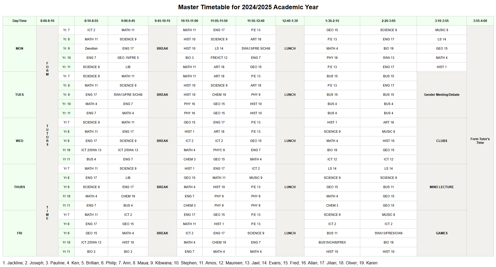

# 👋Hello, I'm Dennis Ong'or
## 🌱 About me 
I am passionate about web development. I enjoy working on projects that involve coding and problem solving.
## 🎯Cuurent learning goals
I am currently learning **computer programming**, focusing on:  
- Frontend & Backend development  
- Building responsive web applications  
- Improving problem-solving skills  
## 🔧Technologies and Tools
HTML5,CSS3,JavaScript,React,Next.js,Tailwind CSS,Node.js,Express.js,MongoDB,REST APIs,GitHub,VS Code,Linux,Command Line,Codespaces
## 📂Current projects
1. **School Timetable Project**
-Recreated a detailed school timetable for the 2024/2025 academic year using **HTML** and **CSS**. The project demonstrates:
- Use of HTML tables with `rowspan` for cell merging.
- Styling with CSS for consistent alignment, color coding, and font sizing.
### Features:
✅ Clean and responsive design  
✅ Correctly merged cells for breaks and lunch periods  
✅ Consistent alignment of subjects and time slots
### Screenshot:

### Technologies Used:
- HTML5
- CSS
## 📫How to Reach Me   
ongordennis@gmail.com  

